# Architecture Overview: AI-Playwright-Test-Generator

This document provides a high-level architectural overview of the AI-Playwright-Test-Generator, detailing its modular structure, component interactions, and core data pipelines.

## 1. High-Level Summary

The system is designed as an **Intelligence Pipeline** that transforms unstructured natural language user stories into executable, high-quality Playwright Python test scripts. It leverages Large Language Models (LLMs) for reasoning and automated web scraping to gain real-world context from target applications.

---

## 2. Project Structure & Module Responsibilities

### 🌐 Interface Layer

| Module | Role |
|--------|------|
| `streamlit_app.py` | Primary entry point. Web-based UI to input user stories, configure LLM providers, and view generation progress/reports. |
| `cli/main.py` | CLI entry point (argparse-based). Triggers the generation pipeline for CI/CD integration. |
| `cli/config.py` | `AnalysisMode`, `ReportFormat` enums and CLI configuration. |
| `cli/input_parser.py` | Parses user story input and file arguments. |
| `cli/test_case_orchestrator.py` | CLI-specific test orchestration wrapper. |
| `cli/evidence_generator.py` | CLI evidence collection and export. |
| `cli/report_generator.py` | CLI report generation (HTML/Markdown/Jira). |

### ⚙️ Orchestration Layer

| Module | Role |
|--------|------|
| `src/orchestrator.py` (`TestOrchestrator`) | The "brain" of the system. Manages sequential execution of the entire pipeline via `run_pipeline()`: analysis → skeleton generation → scraping → placeholder resolution → post-processing. |
| `src/placeholder_orchestrator.py` (`PlaceholderOrchestrator`) | Resolution coordinator. Owns scraper, resolver, and ranker instances. Handles stateful scraping upgrades and sequential placeholder replacement with journey-aware page tracking. |

### 🧠 Intelligence & Analysis Layer

| Module | Role |
|--------|------|
| `src/spec_analyzer.py` | Uses LLMs to parse raw user stories into structured `TestCondition` objects (acceptance criteria). |
| `src/user_story_parser.py` | Breaks down raw user stories into structured components. |
| `src/test_plan.py` | Data model for test planning and coverage tracking. |
| `src/test_generator.py` (`TestGenerator`) | Core engine that generates skeleton Playwright tests with `{{ACTION:description}}` placeholders using the LLM. |
| `src/llm_client.py` (`LLMClient`) | Unified interface for interacting with LLM providers (Ollama, etc.). |
| `src/llm_providers/__init__.py` | Provider registry — maps provider names to implementations. |
| `src/llm_errors.py` | LLM error types and retry logic helpers. |
| `src/prompt_utils.py` | Prompt construction: `build_single_condition_skeleton_prompt()`, `prepare_conditions_for_generation()`, `build_retry_conditions()`. |

### 🔍 Context Extraction Layer

| Module | Role |
|--------|------|
| `src/scraper.py` (`PageScraper`) | Stateless browser scraper. Extracts DOM metadata, captures visibility, screenshot bytes, and element bounding boxes for placeholder resolution and visual enrichment. `scrape_with_enrichment()` applies vision metadata enrichment to captured results. Locators are NEVER injected into LLM prompts. |
| `src/stateful_scraper.py` (`StatefulPageScraper`) | Session-aware browser automation for pages requiring authentication state (cart, checkout). Falls back to PageScraper if session scrape produces no elements. |
| `src/journey_scraper.py` (`CartSeedingScraper`) | Journey-aware scraper — seeds the cart with items, then scrapes cart/checkout pages that require session state. |

### 🛠️ Refinement & Post-processing Layer

| Module | Role |
|--------|------|
| `src/placeholder_resolver.py` (`PlaceholderResolver`) | Critical bridge between "plan" and "reality". Matches placeholders to real CSS/XPath selectors using scraped DOM data. Includes text-content validation and confidence thresholds. |
| `src/locator_scorer.py` (`LocatorScorer`) | Scores locators by reliability: `data-testid > id > name > aria-label > css-class > text > xpath`. Applies +10 bonus when element text matches action description. |
| `src/semantic_candidate_ranker.py` (`SemanticCandidateRanker`) | When multiple candidates have similar scores (threshold ±2), uses LLM to choose the best match. |
| `src/page_object_builder.py` (`PageObjectBuilder`) | Generates Page Object Model classes from scraped page data for test maintainability. |
| `src/skeleton_parser.py` (`SkeletonParser`) | Parses LLM-generated skeleton code → extracts `TestJourney[]`, `PlaceholderUse[]`, `PageRequirement[]`. Normalizes placeholder actions. |
| `src/skeleton_parser.py` (`SkeletonValidator`) | Validates skeleton uses ONLY placeholders, not real CSS selectors (prevents hallucination). |
| `src/code_postprocessor.py` (`normalise_generated_code()`) | Final code normalization: consent mode handling, newline fixes (`normalise_code_newlines()`), import ordering. |
| `src/code_validator.py` (`CodeValidator`) | Validates generated Python for syntax errors and common issues. |

### 💾 Persistence & Reporting Layer

| Module | Role |
|--------|------|
| `src/pipeline_writer.py` (`PipelineWriter`) | Physical creation of `.py` files in `generated_tests/`, including package structuring, file normalization, `scrape_manifest.json`, and `package_manifest.json`. |
| `src/pipeline_artifact_manager.py` (`PackageManifest`) | Package metadata persistence. Handles `package_manifest.json` save/load/discovery. Complementary to `run_result_persistence.py` (which handles pytest run outcomes). Provides `find_existing_packages()` for both CLI and Streamlit. |
| `src/run_result_persistence.py` | Pytest run-outcome persistence: persist/load run results, flakiness detection, run comparison, and run history aggregation. |
| `src/pipeline_run_service.py` | Tracks pipeline run history: run_id, timestamps, artifacts. Supports `run_saved_test()` for re-running from saved package paths. |
| `src/pipeline_report_service.py` | Aggregates execution results, coverage metrics, and screenshots into HTML/Markdown/Jira reports. |
| `src/report_builder.py` | Builds report dictionaries from test results merged with evidence data. |
| `src/report_formatters.py` | Renders reports in 3 formats: local MD, Jira MD, base64 HTML. Includes failure diagnostics section. |
| `src/evidence_tracker.py` (`EvidenceTracker`) | Captures runtime diagnostics during test execution: failure_note, diagnosis, screenshots. |
| `src/evidence_loader.py` | Loads evidence JSON from test packages for report generation. |
| `src/failure_reporter.py` | Generates "Failure Diagnostics" sections with page URL, failure note, suggested alternatives, available elements, screenshot paths. |

| `src/url_utils.py` | URL helpers: `extract_seed_domain()`, `build_common_path_candidates()`, `heuristic_url_from_description()`, `filter_urls_to_allowed_domain()`. |
| `src/url_inference.py` | URL transition inference for journey-aware placeholder resolution. Extracted from `placeholder_orchestrator.py`. |
| `src/pytest_output_parser.py` | Parses pytest stdout → structured results for reporting. |
| `src/config.py` | Pipeline configuration constants. |
| `src/run_utils.py` | Test execution utilities. |
| `src/report_utils.py` | Shared report formatting helpers. |
| `src/coverage_utils.py` | Coverage calculation helpers. |
| `src/gantt_utils.py` | Gantt chart generation for pipeline visualization. |
| `src/heatmap_utils.py` | Heatmap visualization utilities. |
| `src/evidence_serializer.py` | Evidence JSON serialization (sidecar file writing). Extracted from `evidence_tracker.py`. |
| `src/screenshot_capture.py` | Screenshot capture and annotation utilities. Extracted from `evidence_tracker.py`. |
| `src/state_tracker.py` | DOM state tracking — detects changes and URL transitions. Extracted from `journey_scraper.py`. |
| `src/form_detector.py` | Form detection and element classification (selector constants). Extracted from `journey_scraper.py`. |
| `src/semantic_matcher.py` | Token-based semantic similarity for placeholder matching. Extracted from `placeholder_resolver.py`. |
| `src/intent_matcher.py` | Intent-based element filtering for placeholder resolution. Extracted from `placeholder_resolver.py`, then refactored (2026-05-20) into composable bucket-match functions. |
| `src/placeholder_scorers.py` | Composite scoring engine. Individual, testable scoring functions (text_content_bonus, structural_match, product_id_match, click_role_bonus, etc.) and `CompositeScorer.apply_all()`. Extracted from inline scoring in `placeholder_resolver.py` (2026-05-21). |
| `src/code_normalizer.py` | Deterministic code normalization transforms. Extracted from `code_postprocessor.py`. |
| `src/llm_reasoning_filter.py` | LLM reasoning text detection and stripping. Extracted from `code_postprocessor.py`. |

---

## 3. Pipeline Flow (5 Phases)

```
User Input → Phase 1: Analysis → Phase 2: Skeleton Generation → Phase 3: Context Extraction
                                              ↓
Phase 4: Placeholder Resolution → Phase 5: Post-Processing → Phase 6: Output & Reporting
```

### Phase 1: Analysis
`streamlit_app.py` / `cli/main.py` → `spec_analyzer.py` → `llm_client.py` → `TestCondition[]`

Raw user story text is parsed by the LLM into structured acceptance criteria (`TestCondition` objects).

### Phase 2: Skeleton Generation
`orchestrator.py` → `test_generator.py` → `llm_client.py` → skeleton code with placeholders

The LLM generates pytest test skeletons using `{{ACTION:description}}` placeholder syntax. The LLM never sees real locators, eliminating hallucination. If journey count doesn't match expected criteria count, the orchestrator retries once with a stricter prompt.

### Phase 3: Context Extraction
`placeholder_orchestrator.py` → `scraper.py` (stateless) → `journey_scraper.py` / `stateful_scraper.py` (stateful upgrade)

Pages are scraped statelessly first. Then cart/checkout pages are upgraded with session-aware scraping. Pages with 0 elements get a stateful retry.

### Phase 4: Placeholder Resolution
`placeholder_orchestrator.py` → `placeholder_resolver.py` → `semantic_candidate_ranker.py` (LLM tiebreaker, called from orchestrator)

For each journey step, placeholders are resolved sequentially while tracking the active page. The resolver scopes to the current journey URL first, then falls back to all scraped pages. `placeholder_resolver.py` uses inline word-overlap scoring with:
- `semantic_matcher.py` — word tokenization
- `intent_matcher.py` — intent-based filtering (CLICK needs clickable, FILL needs fillable)
- `locator_builder.py` — robust selector construction

When top candidates are within a score threshold, `semantic_candidate_ranker.py` (called from `placeholder_orchestrator`, not the resolver) uses the LLM as tiebreaker.

**Note:** `locator_scorer.py` is NOT part of design-time placeholder resolution. It is used by `locator_fallback.py` (runtime fallback when primary locator fails) and `failure_reporter.py` (diagnostic scoring).

### Phase 5: Post-Processing
`orchestrator.py` → `code_postprocessor.py` → `code_validator.py`

Final code normalization: consent mode injection, newline fixes, import ordering, and syntax validation.

### Phase 6: Output & Reporting
`pipeline_writer.py` → `pipeline_run_service.py` → `pipeline_report_service.py` → `report_builder.py` → `report_formatters.py`

Generated test files are written to `generated_tests/` with a `manifest.json`. After pytest execution, evidence is loaded and reports are generated in 3 formats.

---

## 4. Dependency Graph

```mermaid
graph TD
    subgraph "Interface Layer"
        UI[streamlit_app.py]
        UIPipeline[src/ui_pipeline.py]
        UIRender[src/ui_renderers.py]
        CLI[cli/main.py]
        CLIInput[cli/input_parser.py]
        CLIMenu[cli/menu_renderer.py]
        CLIPipeline[cli/pipeline_runner.py]
        CLIRender[cli/report_generator.py]
        CLIEvidence[cli/evidence_generator.py]
        CLISession[cli/session.py]
        CLITestOrch[cli/test_case_orchestrator.py]
        CLIColor[cli/color.py]
        CLIConfig[cli/config.py]
    end

    subgraph "Orchestration Layer"
        Orch[src/orchestrator.py]
        POrc[src/placeholder_orchestrator.py]
    end

    subgraph "Intelligence Layer"
        Spec[src/spec_analyzer.py]
        Gen[src/test_generator.py]
        LLM[src/llm_client.py]
        Providers[src/llm_providers/]
        Prompt[src/prompt_utils.py]
        SParse[src/skeleton_parser.py]
    end

    subgraph "Context Layer"
        Scrape[src/scraper.py]
        Stateful[src/stateful_scraper.py]
        Journey[src/journey_scraper.py]
        FormDetect[src/form_detector.py]
        StateTrack[src/state_tracker.py]
        URLInfer[src/url_inference.py]
    end

    subgraph "Refinement Layer"
        Res[src/placeholder_resolver.py]
        Score[src/locator_scorer.py]
        Rank[src/semantic_candidate_ranker.py]
        SemMatch[src/semantic_matcher.py]
        IntentMatch[src/intent_matcher.py]
        POM[src/page_object_builder.py]
        PostProc[src/code_postprocessor.py]
        CodeNorm[src/code_normalizer.py]
        LLMFilter[src/llm_reasoning_filter.py]
        Val[src/code_validator.py]
    end

    subgraph "Output Layer"
        Writer[src/pipeline_writer.py]
        RunSvc[src/pipeline_run_service.py]
        ReportSvc[src/pipeline_report_service.py]
        RBuild[src/report_builder.py]
        RFormat[src/report_formatters.py]
        ETrack[src/evidence_tracker.py]
        ESerial[src/evidence_serializer.py]
        SScape[src/screenshot_capture.py]
        ELoad[src/evidence_loader.py]
        FReport[src/failure_reporter.py]
    end

    subgraph "Data Models"
        PModel[src/pipeline_models.py]
    end

    %% Flow of Control
    UI --> UIPipeline
    UI --> UIRender
    CLI --> CLIInput
    CLI --> CLIMenu
    CLI --> CLIPipeline
    CLI --> CLISession
    CLI --> CLIColor
    CLI --> CLIConfig
    CLIInput --> CLIConfig
    CLIMenu --> CLIColor
    CLIPipeline --> Orch
    CLIPipeline --> CLITestOrch
    CLIPipeline --> CLIEvidence
    CLIPipeline --> CLIRender
    UIPipeline --> Orch

    Orch --> Spec
    Orch --> Gen
    Orch --> POrc
    Orch --> PostProc
    Spec --> LLM
    Gen --> LLM
    Gen --> Prompt
    Gen --> SParse
    LLM --> Providers
    POrc --> Scrape
    POrc --> Stateful
    POrc --> Journey
    POrc --> Res
    POrc --> POM
    POrc --> URLInfer
    Journey --> FormDetect
    Journey --> StateTrack
    Res --> SemMatch
    Res --> IntentMatch
    POrc --> Rank
    Rank --> LLM
    FReport --> Score
    PostProc --> CodeNorm
    PostProc --> LLMFilter
    PostProc --> Val
    Orch --> Writer
    Writer --> RunSvc
    Writer --> ReportSvc
    ReportSvc --> RBuild
    RBuild --> ELoad
    RBuild --> FReport
    RFormat --> FReport
    ETrack --> ESerial
    ETrack --> SScape
```



---

## 5. Key Data Flows

### A. Requirement-to-Condition Flow (Analysis)
1. **Input**: Raw text user story from `streamlit_app.py`.
2. **Process**: `TestOrchestrator` passes text to `SpecAnalyzer`.
3. **LLM Action**: `LLMClient` parses the text into structured JSON.
4. **Output**: A list of `TestCondition` objects (Acceptance Criteria).

### B. Skeleton-First Flow (Two-Phase Generation)
1. **Input**: URL/Requirement from `TestOrchestrator`.
2. **Phase 1 - Scraping**: `PageScraper` extracts DOM elements → structured data (`selector`, `text`, `role`). NEVER injected into LLM prompt.
3. **Phase 2 - Skeleton Generation**: `TestGenerator` prompts LLM to write test skeletons using placeholders (`{{CLICK:"checkout button"}}`). LLM never sees locators.
4. **Resolution**: `PlaceholderResolver` matches placeholder descriptions against scraped element metadata → substitutes real Playwright locators.

### C. Generation-to-Artifact Flow (Finalization)
1. **Input**: Resolved Python code string.
2. **Process**: `PipelineWriter` creates a directory for the specific test run.
3. **Output**: A complete, runnable `.py` file saved to `generated_tests/`, accompanied by `manifest.json`.

### D. Execution-to-Evidence Flow (Reporting)
1. **Input**: Command execution via `pytest`.
2. **Process**: `EvidenceTracker` captures runtime diagnostics during test execution.
3. **Aggregation**: `PipelineReportService` collects screenshots, logs, and coverage stats via `EvidenceLoader`.
4. **Output**: Final HTML/Markdown/Jira reports with failure diagnostics presented back to the user.

### E. Journey Scraping Flow (AI-009 Phase B)
1. **Input**: User defines `credential_profile` and `journey_steps` in the Streamlit UI sidebar.
2. **UI Bridge**: `src/ui_pipeline.py` passes `credential_profile`, `journey_steps`, and `scrape_urls` to `TestOrchestrator.run_pipeline()`.
3. **Orchestrator**: `src/orchestrator.py` detects `journey_steps` and calls `execute_journey()` from `src/journey_scraper.py` before static scraping.
4. **Journey Execution**: `execute_journey()` launches a single browser session that follows the user-defined steps (goto, click, fill, capture, wait), capturing DOM metadata at each step.
5. **Auth Detection**: If an auth redirect is detected (e.g., login page URL patterns), the journey scraper logs a warning and continues. SSO/MFA/CAPTCHA trigger explicit errors.
6. **Data Merging**: Journey results merge with static scrape data — journey data supplements (does not overwrite) existing scraped pages. New pages from the journey are added, existing pages are enriched with additional elements.
7. **Resolution**: `PlaceholderOrchestrator` resolves placeholders against the combined scrape data (static + journey).
8. **Data flow**: `UI → ui_pipeline → TestOrchestrator → execute_journey() → merge → PlaceholderOrchestrator → resolution`

---

## 6. Troubleshooting: Error-to-Module Mapping

| Symptom | Likely Module(s) | Phase |
|---------|-----------------|-------|
| "LLM returned empty response" | `llm_client.py`, `.env` (timeout too low) | 2 |
| `SyntaxError` on import lines in generated tests | `code_postprocessor.py` (newline normalization) | 5 |
| `strict mode violation: resolved to 2 elements` | `placeholder_resolver.py` — ambiguous locator | 4 |
| Last criteria get no generated tests | `test_generator.py` — LLM truncation | 2 |
| "pytest.skip: Locator not found" | `placeholder_resolver.py` — no DOM match for description | 4 |
| Wrong element matched for action | `placeholder_resolver.py` (scoring), `semantic_candidate_ranker.py` (LLM tiebreaker) | 4 |
| Cross-page locator mismatch warning | `placeholder_orchestrator.py` → `_verify_page_context()` | 4 |
| Reports missing failure diagnostics | `evidence_loader.py`, `failure_reporter.py` | 6 |
| Generated test fails: `ERR_CONNECTION_REFUSED` | Target site unreachable (not a tool bug) | Runtime |
| Journey count mismatch | `skeleton_parser.py` — LLM didn't generate enough functions | 2 |
| Import error outside Streamlit context | Never import `streamlit_app.py` — triggers `st.set_page_config()` crash | Entry |

---

## 7. Module Documentation Reference

Detailed per-module documentation is available in [`markdown_docs/src/`](../markdown_docs/src/). Each `<module_name>.py.md` file covers public API signatures, dependencies, module constants, design notes, and known gotchas. Use these when:

- **Implementing changes to a specific module** — read the relevant `*.py.md` first for function signatures and type contracts
- **Tasking an LLM** — reference the specific module doc(s) in your prompt rather than the full architecture file to reduce context window waste
- **Onboarding** — follow [`markdown_docs/src/README.md`](../markdown_docs/src/README.md) which indexes all 66 modules by category

| Category | Module Docs |
|----------|-------------|
| Pipeline Core | [orchestrator](../markdown_docs/src/orchestrator.py.md), [pipeline_models](../markdown_docs/src/pipeline_models.py.md), [pipeline_writer](../markdown_docs/src/pipeline_writer.py.md), [pipeline_run_service](../markdown_docs/src/pipeline_run_service.py.md), [pipeline_report_service](../markdown_docs/src/pipeline_report_service.py.md) |
| Scraper Chain | [scraper](../markdown_docs/src/scraper.py.md), [journey_scraper](../markdown_docs/src/journey_scraper.py.md), [stateful_scraper](../markdown_docs/src/stateful_scraper.py.md), [state_tracker](../markdown_docs/src/state_tracker.py.md), [form_detector](../markdown_docs/src/form_detector.py.md) |
| Placeholder System | [placeholder_orchestrator](../markdown_docs/src/placeholder_orchestrator.py.md), [placeholder_resolver](../markdown_docs/src/placeholder_resolver.py.md), [placeholder_scorers](../markdown_docs/src/placeholder_scorers.py.md), [intent_matcher](../markdown_docs/src/intent_matcher.py.md), [semantic_candidate_ranker](../markdown_docs/src/semantic_candidate_ranker.py.md) |
| Code Pipeline | [test_generator](../markdown_docs/src/test_generator.py.md), [skeleton_parser](../markdown_docs/src/skeleton_parser.py.md), [code_normalizer](../markdown_docs/src/code_normalizer.py.md), [code_postprocessor](../markdown_docs/src/code_postprocessor.py.md), [code_validator](../markdown_docs/src/code_validator.py.md) |
| Evidence / Reports | [evidence_tracker](../markdown_docs/src/evidence_tracker.py.md), [evidence_loader](../markdown_docs/src/evidence_loader.py.md), [report_builder](../markdown_docs/src/report_builder.py.md), [report_formatters](../markdown_docs/src/report_formatters.py.md), [failure_reporter](../markdown_docs/src/failure_reporter.py.md) |
| Locator System | [locator_builder](../markdown_docs/src/locator_builder.py.md), [locator_fallback](../markdown_docs/src/locator_fallback.py.md), [locator_repair](../markdown_docs/src/locator_repair.py.md), [locator_scorer](../markdown_docs/src/locator_scorer.py.md) |
| LLM | [llm_client](../markdown_docs/src/llm_client.py.md), [llm_errors](../markdown_docs/src/llm_errors.py.md), [llm_reasoning_filter](../markdown_docs/src/llm_reasoning_filter.py.md), [prompt_utils](../markdown_docs/src/prompt_utils.py.md) |
| Full index | [markdown_docs/src/README.md](../markdown_docs/src/README.md) — all 66 modules by category |

> **Do not merge module docs into this file.** This document covers system-level architecture (data flows, dependency graph, pipeline phases). Module docs cover function-level details (signatures, type hints, internal patterns). They are complementary — cross-references keep both lean.

---

 *Last updated: 2026-05-30*
