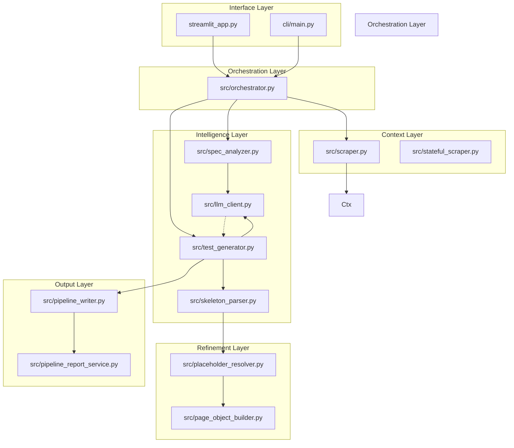

# Architecture Overview: AI-Playwright-Test-Generator

This document provides a high-level architectural overview of the AI-Playwright-Test-Generator, detailing its modular structure, component interactions, and core data pipelines.

## 1. High-Level Summary

The system is designed as an **Intelligence Pipeline** that transforms unstructured natural language user stories into executable, high-quality Playwright Python test scripts. It leverages Large Language Models (LLMs) for reasoning and automated web scraping to gain real-world context from target applications.

### Project Structure & Module Responsibilities

#### 🌐 Interface Layer
*   **`streamlit_app.py`**: The primary entry point for users. Provides a web-based UI to input user stories, configure LLM providers, and view generation progress/reports.
*   **`cli/`**: A secondary interface providing a command-line way to trigger the generation pipeline, suitable for CI/CD integration.
    *   **`cli/main.py`**: CLI entry point (argparse-based).
    *   **`cli/config.py`**: `AnalysisMode`, `ReportFormat` enums and CLI config.
    *   **`cli/input_parser.py`**: Parses user story input and file arguments.
    *   **`cli/analyzer.py`**: Wraps `SpecAnalyzer` for CLI invocation.
    *   **`cli/test_orchestrator.py`**: CLI-specific test orchestration wrapper.
    *   **`cli/evidence_generator.py`**: CLI evidence collection and export.
    *   **`cli/report_generator.py`**: CLI report generation (HTML/Markdown/Jira).

#### ⚙️ Orchestration Layer
*   **`src/orchestrator.py` (`TestOrchestrator`)**: The "brain" of the system. It manages the sequential execution of the entire pipeline: from analyzing requirements and scraping web context to generating code and writing files.

#### 🧠 Intelligence & Analysis Layer
*   **`src/spec_analyzer.py`**: Uses LLMs to parse raw user stories into structured `TestCondition` objects (acceptance criteria).
*   **`src/test_generator.py`**: The core engine that generates the initial "skeleton" of Playwright tests and later produces the final, resolved test code.
*   **`src/llm_client.py`**: A unified interface for interacting with various LLM providers (e.g., Ollama).
*   **`src/skeleton_parser.py`**: Parses the LLM-generated "plan" to identify which pages and placeholders need further resolution.
*   **`src/user_story_parser.py`**: Breaks down raw user stories into structured components.
*   **`src/test_plan.py`**: Data model for test planning and coverage tracking.
*   **`src/llm_errors.py`**: LLM error types and retry logic helpers.

#### 🔍 Context Extraction Layer
*   **`src/scraper.py` (PageScraper)**: Stateless HTTP scraper using httpx + BeautifulSoup. Extracts DOM metadata and returns structured data for the placeholder resolver — locators are NEVER injected into LLM prompts.
*   **`src/stateful_scraper.py` (StatefulPageScraper)**: Session-aware browser automation for pages requiring authentication state (e.g., cart/checkout). Falls back to PageScraper if session scrape produces no elements.
*   **`src/page_context_scraper.py`**: **DEPRECATED** — Retired because it injected selectors directly into LLM prompts via `to_prompt_block()`, causing the LLM to hallucinate variations of those selectors. Replaced by the two-phase skeleton-first pipeline where the LLM writes placeholders (`{{CLICK:description}}`) and the resolver matches them to real locators post-generation.

#### 🛠️ Refinement & Post-processing Layer
*   **`src/placeholder_resolver.py`**: The critical bridge between "plan" and "reality." It takes placeholders (e.g., `{{login_button}}`) from the skeleton code and finds their real CSS/XPath selectors using the scraped DOM data.
*   **`src/page_object_builder.py`**: Generates Page Object Model (POM) classes to promote test maintainability.
*   **`src/semantic_candidate_ranker.py`**: Prioritizes context candidates by relevance (ID > class > text match).
*   **`src/prompt_utils.py`**: Helper utilities for prompt construction, placeholder formatting, and LLM instruction formatting.

#### 💾 Persistence & Reporting Layer
*   **`src/pipeline_writer.py`**: Handles the physical creation of `.py` files in `generated_tests/`, including package structuring and file normalization.
*   **`src/pipeline_report_service.py`**: Aggregates execution results, coverage metrics, and screenshots into human-readable formats (HTML, Markdown, Jira).
*   **`src/pipeline_run_service.py`**: Tracks

---

## 2. Dependency Graph

The following diagram illustrates the directional flow of dependencies and control within the system.

---

## 3. Key Data Flows

### A. Requirement-to-Condition Flow (Analysis)
1.  **Input**: Raw text user story from `streamlit_app.py`.
2.  **Process**: `TestOrchestrator` passes text to `SpecAnalyzer`.
3.  **LLM Action**: `LLMClient` parses the text into structured JSON.
4.  **Output**: A list of `TestCondition` objects (Acceptance Criteria).

### B. Skeleton-First Flow (Two-Phase Generation)
1.  **Input**: URL/Requirement from `TestOrchestrator`.
2.  **Phase 1 - Scraping**: `PageScraper` extracts DOM elements and returns structured data (`selector`, `text`, `role`) to the resolver — NEVER injected into LLM prompt.
3.  **Phase 2 - Skeleton Generation**: `TestGenerator` prompts LLM to write test skeletons using placeholders (e.g., `{{CLICK:"checkout button"}}`). The LLM never sees locators, eliminating hallucination source.
4.  **Resolution**: `PlaceholderResolver` matches placeholder descriptions against scraped element metadata and substitutes real Playwright locators in the final code.

### C. Generation-to-Artifact Flow (Finalization)
1.  **Input**: Resolved Python code string.
2.  **Process**: `PipelineWriter` creates a directory for the specific test run.
3.  **Output**: A complete, runnable `.py` file is saved to `generated_tests/`, accompanied by a `manifest.json` containing metadata and coverage information.

### D. Execution-to-Evidence Flow (Reporting)
1.  **Input**: Command execution via `pytest`.
2.  **Process**: `pytest_output_parser.py` reads the standard output of the test run.
3.  **Aggregation**: `PipelineReportService` collects screenshots, logs, and coverage stats.
4.  **Output**: Final HTML/Markdown reports presented back to the user in the UI.