# Architecture Overview: AI-Playwright-Test-Generator

This document provides a high-level architectural overview of the AI-Playwright-Test-Generator, detailing its modular structure, component interactions, and core data pipelines.

## 1. High-Level Summary

The system is designed as an **Intelligence Pipeline** that transforms unstructured natural language user stories into executable, high-quality Playwright Python test scripts. It leverages Large Language Models (LLMs) for reasoning and automated web scraping to gain real-world context from target applications.

---

## 2. Project Structure & Module Responsibilities

### 🌐 Interface Layer

| Module | Role |
|--------|------|
| `streamlit_app.py` | Primary entry point. Delegates rendering to `src/ui/` modules. |
| `src/ui_pipeline.py` | Pipeline orchestration for the Streamlit UI — bridges UI rendering with `TestOrchestrator`. |
| `src/ui/shared.py` | Shared UI constants: `PIPELINE_KEYS` whitelist (session state keys the pipeline may safely overwrite). |
| `src/ui/ui_requirements.py` | `RequirementsInput` — renders the requirements/user story input panel. |
| `src/ui/ui_journey.py` | `CredentialProfile` and journey builder UI — renders authentication section and journey step configurator. |
| `src/ui/ui_results.py` | `ResultsPanel` — renders final code, skeleton, and scrape summary tabs. |
| `src/ui/ui_evidence.py` | `EvidenceViewer` — annotated screenshots, Gantt charts, heatmaps, run history. |
| `src/ui/ui_run_results.py` | `RunResultsDisplay` — test run results with failure classification and locator repair buttons. |
| `src/ui/ui_downloads.py` | `RenderDownloads` — report download buttons (manifest, local/Jira/HTML reports). |
| `src/ui/ui_saved_packages.py` | `SavedPackagePanel` — sidebar and main panel for loading saved test packages (AI-026). |
| `src/ui/ui_sidebar.py` | `SidebarConfig` — configuration sidebar (provider selection, POM mode toggle). Uses `provider_config.py` for unified provider config. |

#### CLI Layer (`src/cli/`)

> Moved from root `cli/` to `src/cli/` (2026-06-23).

| Module | Role |
|--------|------|
| `src/cli/main.py` | CLI entry point (argparse-based). Triggers the generation pipeline for CI/CD integration. |
| `src/cli/config.py` | `AnalysisMode`, `ReportFormat` enums and CLI configuration. |
| `src/cli/input_parser.py` | Parses user story input and file arguments. |
| `src/cli/test_case_orchestrator.py` | CLI-specific test orchestration wrapper. |
| `src/cli/evidence_generator.py` | CLI evidence collection and export. |
| `src/cli/report_generator.py` | CLI report generation (HTML/Markdown/Jira). |
| `src/cli/session.py` | CLI session state management. |
| `src/cli/pipeline_runner.py` | CLI pipeline execution wrapper — bridges CLI args to `TestOrchestrator`. |
| `src/cli/color.py` | ANSI colour codes for terminal output; auto-disables when stdout is not a TTY. |
| `src/cli/menu_renderer.py` | CLI menu rendering. |
| `src/cli/retro_ui.py` | CHOICE-inspired retro terminal UI — green-on-black, box-drawing menus with ANSI escape codes. |
| `src/cli/terminal_adapter.py` | `TerminalAdapter` — terminal abstraction for reading keys and handling platform quirks (Git Bash, msvcrt). |
| `src/cli/testing_terminal.py` | `QueueTerminal` — testable terminal adapter with queue-based inputs for headless automated tests. |
| `src/cli/run_results_display.py` | Structured ANSI-formatted CLI run results display with failure classification and diagnostics. |

### ⚙️ Orchestration Layer

| Module | Role |
|--------|------|
| `src/orchestrator.py` (`TestOrchestrator`) | The "brain" of the system. Manages sequential execution of the entire pipeline via `run_pipeline()`: analysis → skeleton generation → scraping → placeholder resolution → prerequisite injection → post-processing. |
| `src/placeholder_orchestrator.py` (`PlaceholderOrchestrator`) | Resolution coordinator. Owns scraper, resolver, ranker, and `PageContextTracker` instances. Handles stateful scraping upgrades, sequential placeholder replacement with journey-aware page tracking, and calls `SemanticCandidateRanker` as LLM tiebreaker. |
| `src/page_context_tracker.py` | Tracks which page the resolver should operate on as it processes journey steps. Uses URL inference from element hrefs and action-based heuristics (e.g., "checkout" implies navigation). Extracted from inline tracking in `PlaceholderOrchestrator`. |
| `src/prerequisite_injector.py` | Detects dependency chains in resolved code and injects prerequisite steps. Solves the problem where independent test functions (e.g., "add to cart") need prior state (e.g., login). Operates on `TestJourney` data using keyword-based intent detection. |

### 🧠 Intelligence & Analysis Layer

| Module | Role |
|--------|------|
| `src/spec_analyzer.py` | Uses LLMs to parse raw user stories into structured `TestCondition` objects (acceptance criteria). |
| `src/analyzer.py` | Lightweight user story analyzer (replaces `story_analyzer.py`). |
| `src/user_story_parser.py` | Breaks down raw user stories into structured components. |
| `src/test_plan.py` | Data model for test planning and coverage tracking. |
| `src/test_generator.py` (`TestGenerator`) | Core engine that generates skeleton Playwright tests with `{{ACTION:description}}` placeholders using the LLM. |
| `src/llm_client.py` (`LLMClient`) | Unified interface for interacting with LLM providers. |
| `src/llm_providers/__init__.py` | Provider registry — maps provider names to implementations. |
| `src/llm_errors.py` | LLM error types and retry logic helpers. |
| `src/llm_reasoning_filter.py` | LLM reasoning text detection and stripping. Extracted from `code_postprocessor.py`. |
| `src/prompt_utils.py` | Prompt construction: `build_single_condition_skeleton_prompt()`, `prepare_conditions_for_generation()`, `build_retry_conditions()`. |
| `src/provider_config.py` | Shared LLM provider configuration for CLI and Streamlit. Defines `SUPPORTED_PROVIDERS`, `PROVIDER_LABELS`, and `get_provider_defaults()`. Unifies provider config across UI and CLI (B-021). |

### 🔍 Context Extraction Layer

| Module | Role |
|--------|------|
| `src/scraper.py` (`PageScraper`) | Stateless browser scraper. Extracts DOM metadata, captures visibility, screenshot bytes, and element bounding boxes for placeholder resolution and visual enrichment. `scrape_with_enrichment()` applies vision metadata enrichment to captured results. Locators are NEVER injected into LLM prompts. |
| `src/stateful_scraper.py` (`StatefulPageScraper`) | Session-aware browser automation for pages requiring authentication state (cart, checkout). Falls back to PageScraper if session scrape produces no elements. Uses `form_login_utils.py` for login form detection. |
| `src/journey_scraper.py` (`CartSeedingScraper`) | Journey-aware scraper — seeds the cart with items, then scrapes cart/checkout pages that require session state. |
| `src/journey_executor.py` | Subprocess-backed authenticated journey execution. Distinct from `JourneyScraper` — focuses on user interaction with auth guards (SSO/MFA/CAPTCHA detection via `journey_auth_detector.py`). Uses `journey_models.py` dataclasses. |
| `src/journey_models.py` | Pure dataclasses for journey scraping: `JourneyStep`, `JourneyResult`, `CredentialProfile`, `substitute_templates()`. Lightweight — no Playwright imports. |
| `src/journey_auth_detector.py` | Authentication detection helpers: `detect_auth_redirect()`, `detect_sso()`, `detect_mfa()`, `detect_captcha()`. Extracted from `journey_scraper.py`. |
| `src/form_detector.py` | Form detection and element classification. Extracted from `journey_scraper.py`. |
| `src/state_tracker.py` | DOM state tracking — detects changes and URL transitions. Extracted from `journey_scraper.py`. |
| `src/form_login_utils.py` | Login form detection and filling utilities. Extracted from `stateful_scraper.py`. Handles common demo-site patterns (saucedemo.com, generic). |

#### Enrichment Sub-layer

| Module | Role |
|--------|------|
| `src/accessibility_enricher.py` (`AccessibilityEnricher`) | Merges computed accessible names from the browser's a11y tree (`page.accessibility.snapshot()`) into scraped elements. Additive only — never removes or overwrites existing data. Enables matching placeholders against icon-only buttons with ARIA names. |
| `src/vision_enricher.py` (`VisionEnricher`) | Vision-based element enrichment — uses vision-capable LLMs (Qwen-VL, etc.) to analyze cropped element images and return structured text metadata. Auto-detects vision capability from model name. Zero regression for non-vision LLMs. |
| `src/element_enricher.py` (`ElementEnricher`) | Enriches scraped elements with visual and contextual metadata: icon font detection, bounding box, parent context. Improves placeholder description matching for elements using icon fonts (Font Awesome, Bootstrap, etc.). |

### 🛠️ Refinement & Post-processing Layer

| Module | Role |
|--------|------|
| `src/placeholder_resolver.py` (`PlaceholderResolver`) | Critical bridge between "plan" and "reality". Matches placeholders to real CSS/XPath selectors using scraped DOM data. Includes text-content validation, confidence thresholds, and step-context ASSERT exclusion. |
| `src/semantic_matcher.py` | Token-based semantic similarity for placeholder matching. Extracted from `placeholder_resolver.py`. |
| `src/intent_matcher.py` | Intent-based element filtering for placeholder resolution (CLICK needs clickable, FILL needs fillable). Extracted from `placeholder_resolver.py`, refactored into composable bucket-match functions. |
| `src/placeholder_scorers.py` | Composite scoring engine: `text_content_bonus`, `structural_match`, `product_id_match`, `click_role_bonus`, etc. + `CompositeScorer.apply_all()`. Extracted from inline scoring in `placeholder_resolver.py`. |
| `src/semantic_candidate_ranker.py` (`SemanticCandidateRanker`) | When multiple candidates have similar scores (threshold ±2), uses LLM to choose the best match. Wired into `LLMClient` for ASSERT resolution (B-020). Called from `PlaceholderOrchestrator`, not the resolver. |
| `src/page_object_builder.py` (`PageObjectBuilder`) | Generates Page Object Model classes from scraped page data for test maintainability. |
| `src/skeleton_parser.py` (`SkeletonParser`) | Parses LLM-generated skeleton code → extracts `TestJourney[]`, `PlaceholderUse[]`, `PageRequirement[]`. Normalizes placeholder actions. |
| `src/skeleton_validator.py` (`SkeletonValidator`) | Validates skeleton uses ONLY placeholders, not real CSS selectors (prevents hallucination). Extracted from `skeleton_parser.py`. |
| `src/code_postprocessor.py` (`normalise_generated_code()`) | Final code normalization: consent mode handling, newline fixes (`normalise_code_newlines()`), import ordering. Delegates to `code_normalizer.py` and `llm_reasoning_filter.py`. Also provides `strip_evidence_from_test_code()` and `strip_evidence_from_pom()` for export. |
| `src/code_normalizer.py` | Deterministic code normalization transforms. Extracted from `code_postprocessor.py`. |
| `src/code_validator.py` (`CodeValidator`) | Validates generated Python for syntax errors and common issues. |
| `src/export_service.py` (`ExportService`) | Exports clean test suites from generated packages. Supports POM mode (with page objects) and FLAT mode (tests only). Strips EvidenceTracker artifacts for production-ready output. |

#### Locator System

| Module | Role |
|--------|------|
| `src/locator_builder.py` (`build_robust_locator()`) | Robust selector construction. Extracted from `placeholder_resolver.py`. |
| `src/locator_scorer.py` (`LocatorScorer`) | Scores locators by reliability: `data-testid > id > name > aria-label > css-class > text > xpath`. Applies +10 bonus when element text matches action description. **NOT** part of design-time resolution — used by `locator_fallback.py` (runtime fallback) and `failure_reporter.py` (diagnostics). |
| `src/locator_fallback.py` | Runtime locator fallback — tries alternative locators when primary fails during test execution. |
| `src/locator_repair.py` (`run_codegen_session()`) | Automated locator repair — regenerates locators for failing tests using a codegen LLM session. Triggered from UI run results panel. |

#### URL Resolution

| Module | Role |
|--------|------|
| `src/url_inference.py` | URL transition inference for journey-aware placeholder resolution. Extracted from `placeholder_orchestrator.py`. |
| `src/url_resolver.py` (`UrlResolver`) | Resolves LLM-generated page keywords (e.g., "cart", "checkout") to real URLs discovered by journey scraping. Uses heuristic matching against URL paths with fallback to common path candidates. |
| `src/url_utils.py` | URL helpers: `extract_seed_domain()`, `build_common_path_candidates()`, `heuristic_url_from_description()`, `filter_urls_to_allowed_domain()`. |

### 💾 Persistence & Reporting Layer

| Module | Role |
|--------|------|
| `src/pipeline_writer.py` (`PipelineWriter`) | Physical creation of `.py` files in `generated_tests/`, including package structuring, file normalization, `scrape_manifest.json`, and `package_manifest.json`. |
| `src/pipeline_artifact_manager.py` (`PackageManifest`) | Package metadata persistence. Handles `package_manifest.json` save/load/discovery. Complementary to `run_result_persistence.py` (which handles pytest run outcomes). Provides `find_existing_packages()` for both CLI and Streamlit. |
| `src/run_result_persistence.py` | Pytest run-outcome persistence: persist/load run results, flakiness detection, run comparison, and run history aggregation. |
| `src/sqlite_persistence.py` | SQLite-backed persistence for run results. Mirrors the JSON-based `run_result_persistence.py` API — wrapper layer delegates transparently. Database at `evidence/run_results.sqlite`. AI-012 Phase 1. |
| `src/pipeline_run_service.py` | Tracks pipeline run history: run_id, timestamps, artifacts. Supports `run_saved_test()` for re-running from saved package paths. |
| `src/pipeline_report_service.py` | Aggregates execution results, coverage metrics, and screenshots into HTML/Markdown/Jira reports. |
| `src/report_builder.py` | Builds report dictionaries from test results merged with evidence data. |
| `src/report_formatters.py` | Renders reports in 3 formats: local MD, Jira MD, base64 HTML. Includes failure diagnostics section. |
| `src/evidence_report.py` | Evidence-specific report helpers. Extracted from `report_utils.py`. |
| `src/evidence_tracker.py` (`EvidenceTracker`) | Captures runtime diagnostics during test execution: failure_note, diagnosis, screenshots. Delegates to `evidence_serializer.py` and `screenshot_capture.py`. |
| `src/evidence_loader.py` | Loads evidence JSON from test packages for report generation. |
| `src/evidence_serializer.py` | Evidence JSON serialization (sidecar file writing). Extracted from `evidence_tracker.py`. |
| `src/screenshot_capture.py` | Screenshot capture and annotation utilities. Extracted from `evidence_tracker.py`. |
| `src/failure_reporter.py` | Generates "Failure Diagnostics" sections with page URL, failure note, suggested alternatives, available elements, screenshot paths. Uses `LocatorScorer` for diagnostic scoring. |
| `src/failure_classifier.py` (`FailureCategory`, `classify_failure()`) | Pure-function classifier that maps pytest error messages to categories (`LOCATOR_TIMEOUT`, `STRICT_VIOLATION`, `ASSERTION_FAILURE`, `NAVIGATION_ERROR`, `OTHER`). No Streamlit imports — fully unit testable. Used by UI and CLI run results displays. |
| `src/pytest_output_parser.py` | Parses pytest stdout → structured results for reporting. |
| `src/config.py` | Pipeline configuration constants. |
| `src/run_utils.py` | Test execution utilities. |
| `src/report_utils.py` | Shared report formatting helpers (annotated journeys, suite heatmaps). |
| `src/coverage_utils.py` | Coverage calculation helpers. |
| `src/gantt_utils.py` | Gantt chart generation for pipeline visualization. |
| `src/heatmap_utils.py` | Heatmap visualization utilities. |
| `src/run_history_chart.py` | Plotly figure factory for persisted test-run trends: stacked bar charts with pass-rate overlay and flaky-test markers. Pure Plotly — no Streamlit/CLI dependencies. Also provides `build_chart_from_db()` for direct SQLite queries. AI-011. |
| `src/run_history_cli.py` | CLI renderer for run history — ASCII tables for terminals. Complements the Plotly chart builder for non-GUI environments. |
| `src/export_service.py` (`ExportService`) | Exports clean test suites from generated packages. Supports POM mode (with page objects) and FLAT mode (tests only). Strips EvidenceTracker artifacts for production-ready output. |
| `src/browser_utils.py` | Browser interaction utilities: consent overlay dismissal, ad overlay removal. Uses structural container detection (known consent provider classes) and position-based overlay detection — no global text matching. Called by generated tests, evidence tracker, journey scraper, and stateful scraper. Rewritten 2026-06-23 (B-015 fix). |
| `src/hover_click_utils.py` | Hover-reveal click strategies for hidden elements (display:none, visibility:hidden, opacity:0). Progressive strategies: direct hover → dispatch mouseenter → ancestor traversal → force-show via JS. Extracted from `browser_utils.py`. |
| `src/file_utils.py` | File operation helpers: `slugify()`, `validate_python_syntax` wrapper, timestamped file naming. |

---

## 3. Pipeline Flow (7 Phases)

```
User Input → Phase 1: Analysis → Phase 2: Skeleton Generation → Phase 3: Context Extraction
                                              ↓
Phase 4: Placeholder Resolution → Phase 5: Prerequisite Injection → Phase 6: Post-Processing → Phase 7: Output & Reporting
```

### Phase 1: Analysis
`streamlit_app.py` / `src/cli/main.py` → `spec_analyzer.py` → `llm_client.py` → `TestCondition[]`

Raw user story text is parsed by the LLM into structured acceptance criteria (`TestCondition` objects).

### Phase 2: Skeleton Generation
`orchestrator.py` → `test_generator.py` → `llm_client.py` → skeleton code with placeholders

The LLM generates pytest test skeletons using `{{ACTION:description}}` placeholder syntax. The LLM never sees real locators, eliminating hallucination. `SkeletonValidator` confirms no real selectors leaked into skeletons. If journey count doesn't match expected criteria count, the orchestrator retries once with a stricter prompt.

### Phase 3: Context Extraction
`placeholder_orchestrator.py` → `scraper.py` (stateless) → `journey_scraper.py` / `stateful_scraper.py` (stateful upgrade)

Pages are scraped statelessly first. Then cart/checkout pages are upgraded with session-aware scraping. Pages with 0 elements get a stateful retry.

**Enrichment pipeline** (applied during/after scraping):
- `AccessibilityEnricher` — merges computed accessible names from the browser a11y tree
- `VisionEnricher` — LLM-based analysis of cropped element images (auto-detected, zero regression)
- `ElementEnricher` — visual metadata (icon fonts, bounding boxes, parent context)

### Phase 4: Placeholder Resolution
`placeholder_orchestrator.py` → `placeholder_resolver.py` → `semantic_candidate_ranker.py` (LLM tiebreaker, called from orchestrator)

For each journey step, placeholders are resolved sequentially while `PageContextTracker` maintains the active page. The resolver scopes to the current journey URL first, then falls back to all scraped pages. Scoring uses:
- `semantic_matcher.py` — word tokenization
- `intent_matcher.py` — intent-based filtering (CLICK needs clickable, FILL needs fillable)
- `placeholder_scorers.py` — composite scoring (`text_content_bonus`, `structural_match`, etc.)
- `locator_builder.py` — robust selector construction

Step-context ASSERT exclusion prevents self-matching (B-014).

When top candidates are within a score threshold, `semantic_candidate_ranker.py` (called from `PlaceholderOrchestrator`, not the resolver) uses the LLM as tiebreaker.

**Note:** `locator_scorer.py` is NOT part of design-time placeholder resolution. It is used by `locator_fallback.py` (runtime fallback when primary locator fails) and `failure_reporter.py` (diagnostic scoring).

### Phase 5: Prerequisite Injection
`orchestrator.py` → `prerequisite_injector.py`

Detects dependency chains in resolved code (e.g., "add to cart" requires login) and injects prerequisite `evidence_tracker` calls. Uses keyword-based intent detection on `TestJourney` data.

### Phase 6: Post-Processing
`orchestrator.py` → `code_postprocessor.py` → `code_validator.py`

Final code normalization via `CodeNormalizer`: consent mode injection, newline fixes, import ordering, LLM reasoning text stripping (`llm_reasoning_filter.py`), and syntax validation.

### Phase 7: Output & Reporting
`pipeline_writer.py` → `pipeline_run_service.py` → `pipeline_report_service.py` → `report_builder.py` → `report_formatters.py`

Generated test files are written to `generated_tests/` with `scrape_manifest.json` and `package_manifest.json`. After pytest execution, evidence is loaded and reports are generated in 3 formats. Run results persist to JSON or SQLite (`sqlite_persistence.py`). `ExportService` produces clean output for production use.

---

## 4. Dependency Graph

```mermaid
graph TD
    subgraph "Interface Layer — Streamlit UI"
        UI[streamlit_app.py]
        UIPipeline[src/ui_pipeline.py]
        UIReqs[src/ui/ui_requirements.py]
        UIJourney[src/ui/ui_journey.py]
        UIResults[src/ui/ui_results.py]
        UIEvidence[src/ui/ui_evidence.py]
        UIRunResults[src/ui/ui_run_results.py]
        UIDownloads[src/ui/ui_downloads.py]
        UISaved[src/ui/ui_saved_packages.py]
        UISidebar[src/ui/ui_sidebar.py]
        UIShared[src/ui/shared.py]
    end

    subgraph "Interface Layer — CLI"
        CLI[src/cli/main.py]
        CLIInput[src/cli/input_parser.py]
        CLIMenu[src/cli/menu_renderer.py]
        CLIPipeline[src/cli/pipeline_runner.py]
        CLIRetro[src/cli/retro_ui.py]
        CLIColor[src/cli/color.py]
        CLIConfig[src/cli/config.py]
        CLISession[src/cli/session.py]
        CLITerminal[src/cli/terminal_adapter.py]
        CLITestTerm[src/cli/testing_terminal.py]
        CLIRunResults[src/cli/run_results_display.py]
        CLITestOrch[src/cli/test_case_orchestrator.py]
        CLIEvidence[src/cli/evidence_generator.py]
        CLIRender[src/cli/report_generator.py]
    end

    subgraph "Orchestration Layer"
        Orch[src/orchestrator.py]
        POrc[src/placeholder_orchestrator.py]
        PageCtx[src/page_context_tracker.py]
        PreReq[src/prerequisite_injector.py]
    end

    subgraph "Intelligence Layer"
        Spec[src/spec_analyzer.py]
        Analyzer[src/analyzer.py]
        Gen[src/test_generator.py]
        LLM[src/llm_client.py]
        Providers[src/llm_providers/]
        Prompt[src/prompt_utils.py]
        SParse[src/skeleton_parser.py]
        SVal[src/skeleton_validator.py]
        ProvCfg[src/provider_config.py]
        LLMFilter[src/llm_reasoning_filter.py]
    end

    subgraph "Context Layer"
        Scrape[src/scraper.py]
        Stateful[src/stateful_scraper.py]
        Journey[src/journey_scraper.py]
        JExec[src/journey_executor.py]
        JModels[src/journey_models.py]
        JAuthDetect[src/journey_auth_detector.py]
        FormDetect[src/form_detector.py]
        StateTrack[src/state_tracker.py]
        FormLogin[src/form_login_utils.py]
        URLInfer[src/url_inference.py]
        URLRes[src/url_resolver.py]
        URLUtils[src/url_utils.py]
    end

    subgraph "Enrichment Layer"
        A11y[src/accessibility_enricher.py]
        Vision[src/vision_enricher.py]
        ElemEnrich[src/element_enricher.py]
    end

    subgraph "Refinement Layer"
        Res[src/placeholder_resolver.py]
        Rank[src/semantic_candidate_ranker.py]
        SemMatch[src/semantic_matcher.py]
        IntentMatch[src/intent_matcher.py]
        Scoring[src/placeholder_scorers.py]
        POM[src/page_object_builder.py]
        PostProc[src/code_postprocessor.py]
        CodeNorm[src/code_normalizer.py]
        Val[src/code_validator.py]
        LocBuild[src/locator_builder.py]
        LocScore[src/locator_scorer.py]
        LocFallback[src/locator_fallback.py]
        LocRepair[src/locator_repair.py]
    end

    subgraph "Output Layer"
        Writer[src/pipeline_writer.py]
        RunSvc[src/pipeline_run_service.py]
        ReportSvc[src/pipeline_report_service.py]
        RBuild[src/report_builder.py]
        RFormat[src/report_formatters.py]
        EReport[src/evidence_report.py]
        ExportSvc[src/export_service.py]
        ETrack[src/evidence_tracker.py]
        ESerial[src/evidence_serializer.py]
        SScape[src/screenshot_capture.py]
        ELoad[src/evidence_loader.py]
        FReport[src/failure_reporter.py]
        FClass[src/failure_classifier.py]
    end

    subgraph "Persistence Layer"
        PersistJSON[src/run_result_persistence.py]
        PersistSQL[src/sqlite_persistence.py]
        ArtMgr[src/pipeline_artifact_manager.py]
    end

    subgraph "Visualization Layer"
        Gantt[src/gantt_utils.py]
        Heatmap[src/heatmap_utils.py]
        RunChart[src/run_history_chart.py]
        RunCLI[src/run_history_cli.py]
        Coverage[src/coverage_utils.py]
    end

    subgraph "Utilities"
        BrowserUtil[src/browser_utils.py]
        HoverClick[src/hover_click_utils.py]
        FileUtils[src/file_utils.py]
        Config[src/config.py]
        RunUtils[src/run_utils.py]
        RptUtils[src/report_utils.py]
    end

    subgraph "Data Models"
        PModel[src/pipeline_models.py]
    end

    %% Flow of Control — Streamlit
    UI --> UIPipeline
    UI --> UIReqs
    UI --> UIJourney
    UI --> UIResults
    UI --> UIEvidence
    UI --> UIRunResults
    UI --> UIDownloads
    UI --> UISaved
    UI --> UISidebar
    UIReqs --> UIShared
    UISidebar --> ProvCfg
    UIRunResults --> FClass
    UIRunResults --> LocRepair
    UIPipeline --> Orch

    %% Flow of Control — CLI
    CLI --> CLIInput
    CLI --> CLIMenu
    CLI --> CLIPipeline
    CLI --> CLISession
    CLI --> CLIColor
    CLI --> CLIConfig
    CLI --> CLIRetro
    CLI --> CLITerminal
    CLIInput --> CLIConfig
    CLIMenu --> CLIColor
    CLIPipeline --> Orch
    CLIPipeline --> CLITestOrch
    CLIPipeline --> CLIEvidence
    CLIPipeline --> CLIRender
    CLIPipeline --> CLIRunResults
    CLIRunResults --> FClass

    %% Orchestrator flow
    Orch --> Spec
    Orch --> Gen
    Orch --> POrc
    Orch --> PreReq
    Orch --> PostProc
    Orch --> Writer
    Spec --> LLM
    Gen --> LLM
    Gen --> Prompt
    Gen --> SParse
    Gen --> SVal
    LLM --> Providers

    %% Resolution flow
    POrc --> Scrape
    POrc --> Stateful
    POrc --> Journey
    POrc --> Res
    POrc --> POM
    POrc --> Rank
    POrc --> PageCtx
    POrc --> URLInfer
    Rank --> LLM
    Journey --> JModels
    Journey --> JAuthDetect
    Journey --> FormDetect
    Journey --> StateTrack
    Stateful --> FormLogin
    JExec --> JModels
    JExec --> JAuthDetect
    JExec --> Scrape
    JExec --> A11y

    %% Enrichment
    Scrape --> A11y
    Scrape --> Vision
    Scrape --> ElemEnrich

    %% Resolver internals
    Res --> SemMatch
    Res --> IntentMatch
    Res --> Scoring
    Res --> LocBuild
    URLInfer --> URLUtils
    URLRes --> URLUtils

    %% Locator runtime
    LocFallback --> LocScore
    FReport --> LocScore

    %% Post-processing
    PostProc --> CodeNorm
    PostProc --> LLMFilter
    PostProc --> Val
    ExportSvc --> PostProc

    %% Output & persistence
    Writer --> RunSvc
    Writer --> ReportSvc
    Writer --> ArtMgr
    ReportSvc --> RBuild
    ReportSvc --> RFormat
    RBuild --> ELoad
    RBuild --> FReport
    RBuild --> EReport
    RFormat --> FReport
    ETrack --> ESerial
    ETrack --> SScape
    RunSvc --> PersistJSON
    PersistJSON --> PersistSQL

    %% Visualization
    UIEvidence --> Gantt
    UIEvidence --> Heatmap
    UIEvidence --> RunChart
    RunChart --> PersistJSON
    RunCLI --> PersistJSON
    Coverage --> RBuild

    %% Utilities
    HoverClick --> BrowserUtil
```



---

## 5. Key Data Flows

### A. Requirement-to-Condition Flow (Analysis)
1. **Input**: Raw text user story from `streamlit_app.py`.
2. **Process**: `TestOrchestrator` passes text to `SpecAnalyzer`.
3. **LLM Action**: `LLMClient` parses the text into structured JSON.
4. **Output**: A list of `TestCondition` objects (Acceptance Criteria).

### B. Skeleton-First Flow (Two-Phase Generation)
1. **Input**: URL/Requirement from `TestOrchestrator`.
2. **Phase 1 - Scraping**: `PageScraper` extracts DOM elements → structured data (`selector`, `text`, `role`). NEVER injected into LLM prompt.
3. **Enrichment**: `AccessibilityEnricher` merges a11y tree computed names; `VisionEnricher` analyzes cropped images via vision LLM; `ElementEnricher` adds icon font and bounding box metadata.
4. **Phase 2 - Skeleton Generation**: `TestGenerator` prompts LLM to write test skeletons using placeholders (`{{CLICK:"checkout button"}}`). LLM never sees locators. `SkeletonValidator` confirms no real selectors leaked.
5. **Resolution**: `PlaceholderResolver` matches placeholder descriptions against enriched scraped element metadata → substitutes real Playwright locators. `PageContextTracker` maintains active page state.

### C. Generation-to-Artifact Flow (Finalization)
1. **Input**: Resolved Python code string.
2. **Prerequisite Injection**: `PrerequisiteInjector` detects dependency chains and injects prerequisite steps.
3. **Post-Processing**: `CodePostprocessor` → `CodeNormalizer` → `LLMReasoningFilter` → `CodeValidator`.
4. **Output**: `PipelineWriter` creates a directory in `generated_tests/` with `scrape_manifest.json` and `package_manifest.json`.
5. **Export**: `ExportService` strips `EvidenceTracker` artifacts for production-ready output.

### D. Execution-to-Evidence Flow (Reporting)
1. **Input**: Command execution via `pytest`.
2. **Process**: `EvidenceTracker` captures runtime diagnostics during test execution (delegates to `EvidenceSerializer` and `ScreenshotCapture`).
3. **Aggregation**: `PipelineReportService` collects screenshots, logs, and coverage stats via `EvidenceLoader`.
4. **Classification**: `FailureClassifier` maps error messages to categories (`LOCATOR_TIMEOUT`, `STRICT_VIOLATION`, etc.).
5. **Persistence**: Run results stored to JSON (`run_result_persistence.py`) or SQLite (`sqlite_persistence.py`).
6. **Visualization**: `RunHistoryChart` (Plotly) or `RunHistoryCLI` (ASCII) renders trends.
7. **Output**: Final HTML/Markdown/Jira reports with failure diagnostics. UI run results panel offers `LocatorRepair` (codegen LLM session) for failing tests.

### E. Journey Scraping Flow (AI-009 Phase B)
1. **Input**: User defines `credential_profile` and `journey_steps` in the Streamlit UI sidebar (`src/ui/ui_journey.py`).
2. **UI Bridge**: `src/ui_pipeline.py` passes `credential_profile`, `journey_steps`, and `scrape_urls` to `TestOrchestrator.run_pipeline()`.
3. **Orchestrator**: `src/orchestrator.py` detects `journey_steps` and calls `execute_journey()` from `src/journey_scraper.py` before static scraping.
4. **Journey Execution**: `execute_journey()` launches a single browser session that follows the user-defined steps (goto, click, fill, capture, wait), capturing DOM metadata at each step.
5. **Auth Detection**: `journey_auth_detector.py` — if an auth redirect is detected (e.g., login page URL patterns), the journey scraper logs a warning and continues. SSO/MFA/CAPTCHA trigger explicit errors.
6. **Data Merging**: Journey results merge with static scrape data — journey data supplements (does not overwrite) existing scraped pages. New pages from the journey are added, existing pages are enriched with additional elements.
7. **Resolution**: `PlaceholderOrchestrator` resolves placeholders against the combined scrape data (static + journey). `UrlResolver` maps LLM-generated page keywords to real URLs discovered by journey scraping.
8. **Data flow**: `ui_journey → ui_pipeline → TestOrchestrator → execute_journey() → merge → PlaceholderOrchestrator → resolution`

---

## 6. Troubleshooting: Error-to-Module Mapping

| Symptom | Likely Module(s) | Phase |
|---------|-----------------|-------|
| "LLM returned empty response" | `llm_client.py`, `.env` (timeout too low) | 2 |
| `SyntaxError` on import lines in generated tests | `code_normalizer.py` (newline normalization) | 6 |
| `strict mode violation: resolved to 2 elements` | `placeholder_resolver.py` — ambiguous locator | 4 |
| Last criteria get no generated tests | `test_generator.py` — LLM truncation | 2 |
| "pytest.skip: Locator not found" | `placeholder_resolver.py` — no DOM match for description | 4 |
| Wrong element matched for action | `placeholder_resolver.py` (scoring), `semantic_candidate_ranker.py` (LLM tiebreaker) | 4 |
| ASSERT matches the element it just clicked | `placeholder_resolver.py` — step-context exclusion (B-014) | 4 |
| Cross-page locator mismatch warning | `page_context_tracker.py` — incorrect page transition inference | 4 |
| Prerequisite steps not injected | `prerequisite_injector.py` — keyword detection missed the dependency | 5 |
| Reports missing failure diagnostics | `evidence_loader.py`, `failure_reporter.py` | 7 |
| Generated test fails: `ERR_CONNECTION_REFUSED` | Target site unreachable (not a tool bug) | Runtime |
| Journey count mismatch | `skeleton_parser.py` — LLM didn't generate enough functions | 2 |
| Skeleton contains real CSS selectors | `skeleton_validator.py` — hallucination not caught | 2 |
| Import error outside Streamlit context | Never import `streamlit_app.py` — triggers `st.set_page_config()` crash | Entry |
| Journey discovery navigates to wrong page | `browser_utils.py` — `dismiss_consent_overlays()` clicks non-overlay buttons | 3 |
| Consent banner dismissal breaks page navigation | `browser_utils.py` — structural container detection missed the overlay | 3 |
| Icon-only buttons not matched | `accessibility_enricher.py` — a11y tree not captured or merged | 3 |
| Vision enrichment slow/missing | `vision_enricher.py` — model not vision-capable or API timeout | 3 |
| Hidden elements not clickable | `hover_click_utils.py` — hover strategies exhausted | Runtime |
| Locator repair loop | `locator_repair.py` — codegen session returns same locator | Runtime |
| SQLite persistence errors | `sqlite_persistence.py` — `evidence/` dir not writable | 7 |
| Provider config mismatch (UI vs CLI) | `provider_config.py` — env vars not set consistently | Entry |

---

## 7. Module Documentation Reference

Detailed per-module documentation is available in [`markdown_docs/src/`](../markdown_docs/src/). Each `<module_name>.py.md` file covers public API signatures, dependencies, module constants, design notes, and known gotchas. Use these when:

- **Implementing changes to a specific module** — read the relevant `*.py.md` first for function signatures and type contracts
- **Tasking an LLM** — reference the specific module doc(s) in your prompt rather than the full architecture file to reduce context window waste
- **Onboarding** — follow [`markdown_docs/src/README.md`](../markdown_docs/src/README.md) which indexes all modules by category

| Category | Module Docs |
|----------|-------------|
| Pipeline Core | [orchestrator](../markdown_docs/src/orchestrator.py.md), [pipeline_models](../markdown_docs/src/pipeline_models.py.md), [pipeline_writer](../markdown_docs/src/pipeline_writer.py.md), [pipeline_run_service](../markdown_docs/src/pipeline_run_service.py.md), [pipeline_report_service](../markdown_docs/src/pipeline_report_service.py.md), [pipeline_artifact_manager](../markdown_docs/src/pipeline_artifact_manager.py.md), [prerequisite_injector](../markdown_docs/src/prerequisite_injector.py.md), [page_context_tracker](../markdown_docs/src/page_context_tracker.py.md) |
| UI Layer | [ui_pipeline](../markdown_docs/src/ui_pipeline.py.md), [ui/shared](../markdown_docs/src/ui/shared.py.md), [ui/ui_requirements](../markdown_docs/src/ui/ui_requirements.py.md), [ui/ui_journey](../markdown_docs/src/ui/ui_journey.py.md), [ui/ui_results](../markdown_docs/src/ui/ui_results.py.md), [ui/ui_evidence](../markdown_docs/src/ui/ui_evidence.py.md), [ui/ui_run_results](../markdown_docs/src/ui/ui_run_results.py.md), [ui/ui_downloads](../markdown_docs/src/ui/ui_downloads.py.md), [ui/ui_saved_packages](../markdown_docs/src/ui/ui_saved_packages.py.md), [ui/ui_sidebar](../markdown_docs/src/ui/ui_sidebar.py.md) |
| CLI Layer | [cli/main](../markdown_docs/src/cli/main.py.md), [cli/pipeline_runner](../markdown_docs/src/cli/pipeline_runner.py.md), [cli/retro_ui](../markdown_docs/src/cli/retro_ui.py.md), [cli/terminal_adapter](../markdown_docs/src/cli/terminal_adapter.py.md), [cli/testing_terminal](../markdown_docs/src/cli/testing_terminal.py.md), [cli/run_results_display](../markdown_docs/src/cli/run_results_display.py.md) |
| Scraper Chain | [scraper](../markdown_docs/src/scraper.py.md), [journey_scraper](../markdown_docs/src/journey_scraper.py.md), [journey_executor](../markdown_docs/src/journey_executor.py.md), [journey_models](../markdown_docs/src/journey_models.py.md), [journey_auth_detector](../markdown_docs/src/journey_auth_detector.py.md), [stateful_scraper](../markdown_docs/src/stateful_scraper.py.md), [state_tracker](../markdown_docs/src/state_tracker.py.md), [form_detector](../markdown_docs/src/form_detector.py.md), [form_login_utils](../markdown_docs/src/form_login_utils.py.md) |
| Enrichment | [accessibility_enricher](../markdown_docs/src/accessibility_enricher.py.md), [vision_enricher](../markdown_docs/src/vision_enricher.py.md), [element_enricher](../markdown_docs/src/element_enricher.py.md) |
| Placeholder System | [placeholder_orchestrator](../markdown_docs/src/placeholder_orchestrator.py.md), [placeholder_resolver](../markdown_docs/src/placeholder_resolver.py.md), [placeholder_scorers](../markdown_docs/src/placeholder_scorers.py.md), [intent_matcher](../markdown_docs/src/intent_matcher.py.md), [semantic_candidate_ranker](../markdown_docs/src/semantic_candidate_ranker.py.md), [semantic_matcher](../markdown_docs/src/semantic_matcher.py.md) |
| Code Pipeline | [test_generator](../markdown_docs/src/test_generator.py.md), [skeleton_parser](../markdown_docs/src/skeleton_parser.py.md), [skeleton_validator](../markdown_docs/src/skeleton_validator.py.md), [code_normalizer](../markdown_docs/src/code_normalizer.py.md), [code_postprocessor](../markdown_docs/src/code_postprocessor.py.md), [code_validator](../markdown_docs/src/code_validator.py.md), [export_service](../markdown_docs/src/export_service.py.md) |
| Locator System | [locator_builder](../markdown_docs/src/locator_builder.py.md), [locator_fallback](../markdown_docs/src/locator_fallback.py.md), [locator_repair](../markdown_docs/src/locator_repair.py.md), [locator_scorer](../markdown_docs/src/locator_scorer.py.md) |
| Evidence / Reports | [evidence_tracker](../markdown_docs/src/evidence_tracker.py.md), [evidence_loader](../markdown_docs/src/evidence_loader.py.md), [evidence_serializer](../markdown_docs/src/evidence_serializer.py.md), [evidence_report](../markdown_docs/src/evidence_report.py.md), [report_builder](../markdown_docs/src/report_builder.py.md), [report_formatters](../markdown_docs/src/report_formatters.py.md), [failure_reporter](../markdown_docs/src/failure_reporter.py.md), [failure_classifier](../markdown_docs/src/failure_classifier.py.md), [screenshot_capture](../markdown_docs/src/screenshot_capture.py.md) |
| Persistence | [run_result_persistence](../markdown_docs/src/run_result_persistence.py.md), [sqlite_persistence](../markdown_docs/src/sqlite_persistence.py.md), [run_history_chart](../markdown_docs/src/run_history_chart.py.md), [run_history_cli](../markdown_docs/src/run_history_cli.py.md) |
| LLM | [llm_client](../markdown_docs/src/llm_client.py.md), [llm_errors](../markdown_docs/src/llm_errors.py.md), [llm_reasoning_filter](../markdown_docs/src/llm_reasoning_filter.py.md), [prompt_utils](../markdown_docs/src/prompt_utils.py.md), [provider_config](../markdown_docs/src/provider_config.py.md) |
| URL System | [url_inference](../markdown_docs/src/url_inference.py.md), [url_resolver](../markdown_docs/src/url_resolver.py.md), [url_utils](../markdown_docs/src/url_utils.py.md) |
| Utilities | [browser_utils](../markdown_docs/src/browser_utils.py.md), [hover_click_utils](../markdown_docs/src/hover_click_utils.py.md), [file_utils](../markdown_docs/src/file_utils.py.md), [coverage_utils](../markdown_docs/src/coverage_utils.py.md), [gantt_utils](../markdown_docs/src/gantt_utils.py.md), [heatmap_utils](../markdown_docs/src/heatmap_utils.py.md) |
| Full index | [markdown_docs/src/README.md](../markdown_docs/src/README.md) |

> **Do not merge module docs into this file.** This document covers system-level architecture (data flows, dependency graph, pipeline phases). Module docs cover function-level details (signatures, type hints, internal patterns). They are complementary — cross-references keep both lean.

---

 *Last updated: 2026-07-08*
